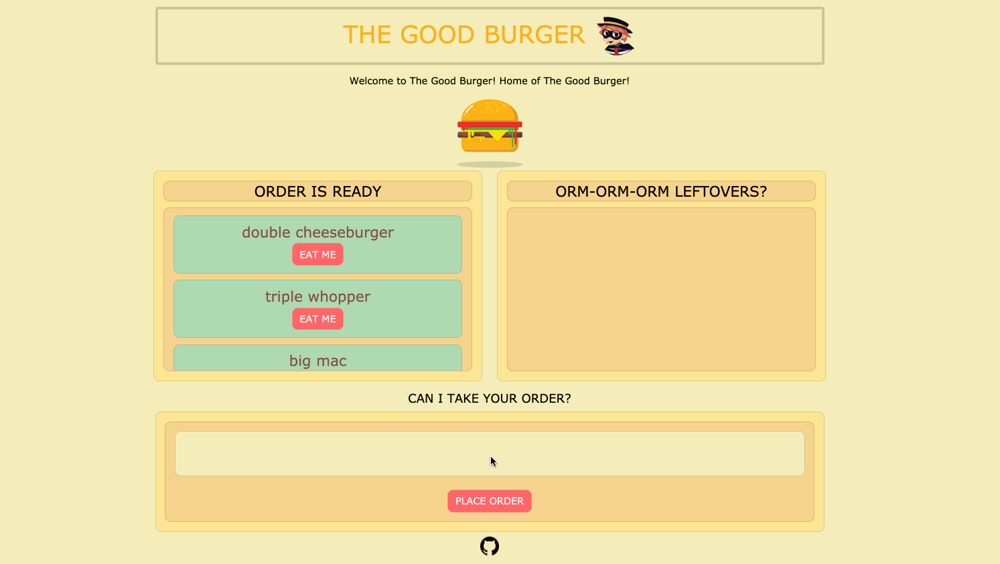

# Hamburglar (The Good Burger Logger)

In this project, I created a fun application that logs in burger orders using MySQL, Node, Express, Handlebars and a homemade ORM. This follows the MVC design patter and uses Node and MySQL to query and route date into the application and using Handlebars to generate the page. This application is also mobile-responsive!

This is a diner application that lets users input the names of burgers they would like to eat and when submitting their order, it will be in the "order is ready" column waiting to be eaten and munched on (ORM-ORM!). And when the user is ready to eat the burger, there could be some leftovers or trash around so it's time to throw it away because CLAY-GO (clean as you go)! Each burger will be stored in the database when the user orders and eats the burger but when the user throws it away, the burger is then removed from the database. 

This was a fun application to build, adding my own styling and flavor to this project. I definitely enjoyed and appreciated handlebars and MVC. At first, it was intimidating to understand but working with this project, I am able to dissect what and how this is working. 

## Table of Contents

* [Technologies Used](#technologies-used)
* [GIF of Project](#gif-of-project)
* [Image of Project](#image-of-project)
* [Code Snippet](#code-snippet)
* [Deployed Link](#deployed-link)
* [Authors](#authors)
* [License](#license)
* [Acknowledgments](#acknowledgments)

## Technologies Used

* [Node.js](https://nodejs.org/en/)
* [Javascript](https://developer.mozilla.org/en-US/docs/Web/JavaScript)
* [jquery](https://jquery.com/)
* [MySQL](https://www.mysql.com/)
* [Express.js](https://expressjs.com/)
* [Handlebars](https://www.npmjs.com/package/express-handlebars)
* [HTML](https://developer.mozilla.org/en-US/docs/Web/HTML)
* [CSS](https://developer.mozilla.org/en-US/docs/Web/CSS)
* [Bootstrap](https://getbootstrap.com/)
* [JawsDB](https://www.jawsdb.com/)


## GIF of Project



## Images of Project

Attached below is a sample image of the burger application.


## Code Snippet
  
  I chose this code snippet because this is unique to me and sparked interest on how this works  and it takes in an object and converting it into proper sql syntax that will be used in the orm. 

```
function objToSql(ob) {
    // empty array to push converted values
    var arr = [];

    // loop through the keys and push the key/value as a string int arr
    for (var key in ob) {
        var value = ob[key];
        // checks to skip hidden properties
        if (Object.hasOwnProperty.call(ob, key)) {
            // if string has spaces, add quotations
            if (typeof value === "string" && value.indexOf(" ") >= 0) {
                value = "'" + value + "'";
            };
            // converts object to this ex. {devoured: true} => ["devoured=true"]
            arr.push(key + "=" + value);
        };
    };
    // translate array of strings to a single comma-separated string
    return arr.toString();
};
```

## Deployed Link

* [See Live Website](https://thegoodburger.herokuapp.com/)

## Authors

* Janessa Reeanne Fong

- [Link to Github](https://github.com/janessaref)
- [Link to LinkedIn](https://www.linkedin.com/in/janessafong)

## License

This project is licensed under the MIT License 

## Acknowledgments

* I'd like to acknowledge Andrew Knapp, my tutor who has helped me understand more on handlebars.
* I'd like to also acknowledge my instructors and TAs, Roger Lee, Kerwin Hy and Manuel Nunes that helped me towards accomplishing this project.
* I'd like to acknowledge the drawing of Beisbol Cat for the hamburglar cartoon: https://www.deviantart.com/beisebolcat/art/Hamburglar-839103733
* I'd like to acknowledge the burger photo by 9george: https://www.123rf.com/photo_88788944_stock-vector-hamburger-icon-with-float-shadow-flat-style-vector-illustration.html


